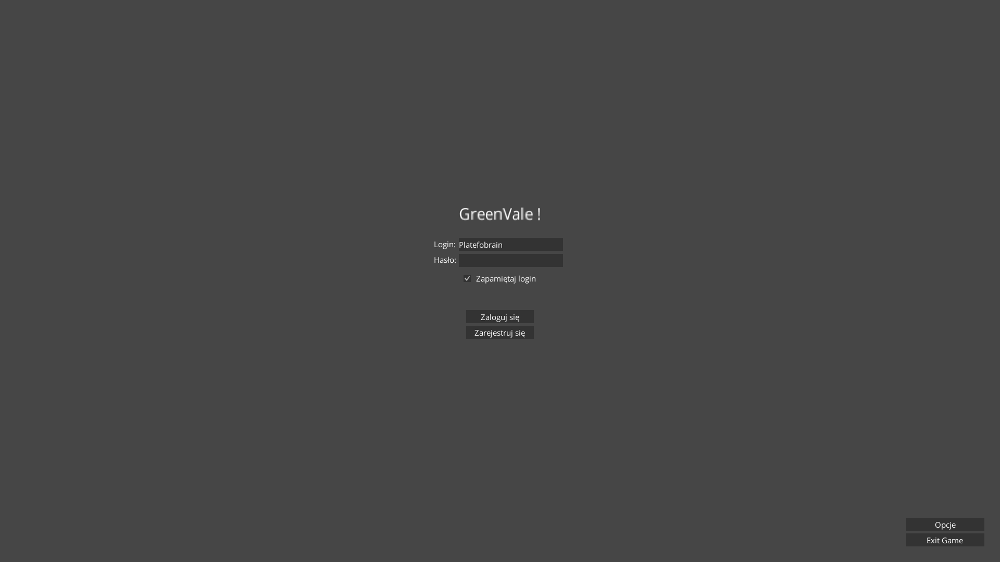
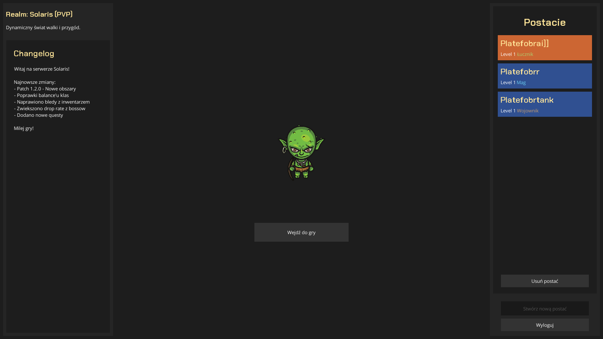
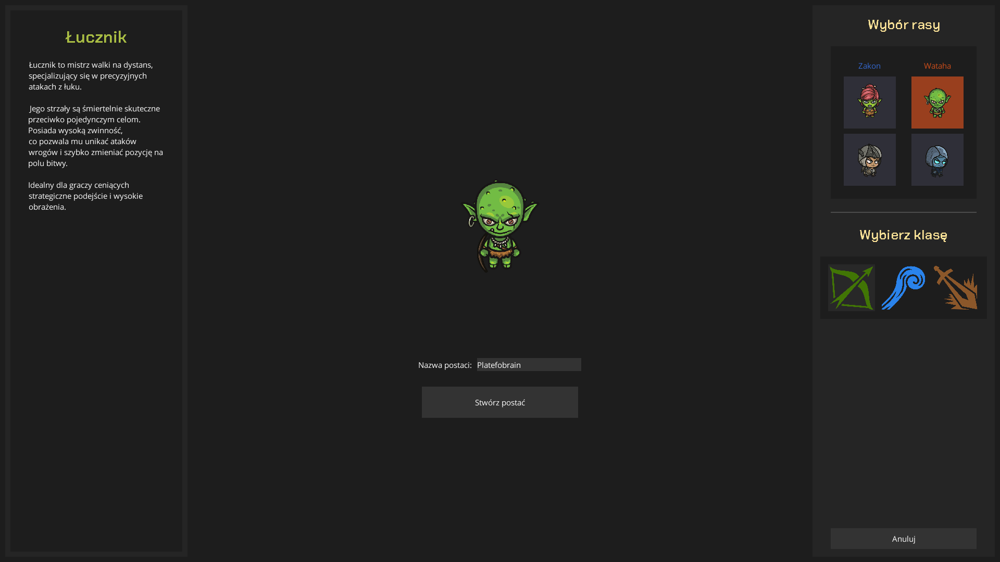
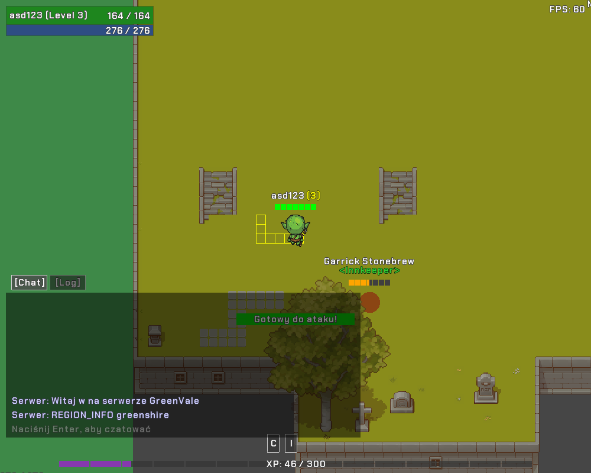
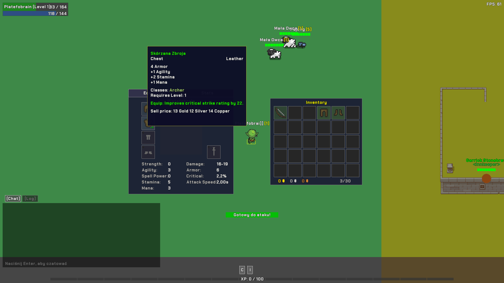

# 🎮 GreenVale - MMO Game


Wieloosobowa gra RPG napisana w Kotlinie z wykorzystaniem LibGDX i Ktor WebSocket. GreenVale oferuje klasyczny gameplay MMO z systemem walk, itemów, questów i interakcji społecznych.

---

## 📸 Screenshots

### Rejestracja i tworzenie postaci




### Rozgrywka



---

## ✨ Główne Funkcjonalności

### 🎮 System Rozgrywki
- **3 klasy postaci**: Łucznik, Mag, Wojownik
- **System poziomów i XP** z wizualnym paskiem postępu
- **Pathfinding** z wizualizacją ścieżki
- **Płynna kamera** śledząca gracza
- **System respawnu** po śmierci

### ⚔️ System Walki
- **Combat w czasie rzeczywistym**
- **Różne zasięgi ataku** dla każdej klasy
  - Łucznik: 295px (dystans)
  - Mag: 245px (średni zasięg)
  - Wojownik: 40px (ближний бій)
- **System cooldownów** z wizualizacją
- **Animowane ataki** (łuk, czary, miecz)
- **Damage numbers** z efektami
- **Health bary** z segmentami dla wszystkich jednostek

### 👥 System Graczy
- **Rejestracja i logowanie**
- **Multi-character support** (wiele slotów postaci)
- **Synchronizacja w czasie rzeczywistym**
- **System frakcji**: Wataha vs Zakon
- **System ras**: Człowiek, Elf, Goblin, Nieumarły
- **Kolorowe oznaczenia** (przyjaciel/wróg)

### 🐺 System Przeciwników (AI)
- **Różne typy mobów**: Owca, Wilk, Niedźwiedź, Pająk
- **Zaawansowane AI** z stanami: IDLE, PATROL, CHASE, ATTACK
- **System agro** i śledzenia gracza
- **Animowane skórki**
- **Drop itemów** po śmierci
- **Automatyczny respawn**

### 🤝 System NPC
- **Interaktywne NPC** z różnymi typami
- **System frakcji** dla NPC
- **Typy NPC**: Kupiec, Quest Giver, Guard
- **Gotowy do rozbudowy** o dialogi i questy

### 🎒 System Itemów
- **Pełny system ekwipunku**
  - Plecak (inventory)
  - Ekwipunek postaci (helmet, chest, legs, boots, gloves, weapon, shield)
- **Drag & drop** między slotami
- **Item tooltips** ze statystykami
- **Dropped items** na mapie z autolootem
- **System walut**: Złoto, Srebro, Miedź
- **Ikony itemów** z teksturami

### 💬 Komunikacja
- **Chat globalny** z kolorowym formatowaniem
- **Combat log** (osobna zakładka)
- **System wiadomości** na środku ekranu z animacjami
- **Pełne wsparcie polskich znaków**

### 🗺️ Mapy i Świat
- **5 różnych lokacji**:
  - GreenShire (startowa)
  - Forest (las)
  - Desert (pustynia)
  - Mountains (góry)
  - Swamp (bagno)
- **Kafelkowy system map** (tilemap)
- **Warstwy**: podłoże, obiekty, kolizje
- **Culling** (optymalizacja renderowania)

### 🎨 Interfejs Użytkownika
- **Player unit frame** (HP, Mana, Nick, Level)
- **Target frame** (dla graczy, mobów, NPC)
- **XP bar** z segmentami
- **Skill cooldown bar**
- **Character window** (statystyki)
- **Inventory panel** (40 slotów)
- **Chat window** z przełączaniem Chat/Log
- **FPS counter**
- **Item tooltips** z hover effect
- **Menu ESC**

---

## 🚀 Technologie

### Client
- **Kotlin** - język programowania
- **LibGDX** - framework do gier 2D/3D
- **Coroutines** - programowanie asynchroniczne
- **FreeType** - renderowanie fontów

### Server
- **Ktor** - framework webowy
- **WebSocket** - komunikacja w czasie rzeczywistym
- **Coroutines** - wielowątkowość

### Narzędzia
- **Gradle** - system budowania
- **Git** - kontrola wersji

---

## 📦 Instalacja i Uruchomienie

### Wymagania
- Java 17 lub nowsza
- Gradle 8.0+
- Min. 2GB RAM

### Uruchomienie Serwera
```bash
cd server-mmo
./gradlew run
